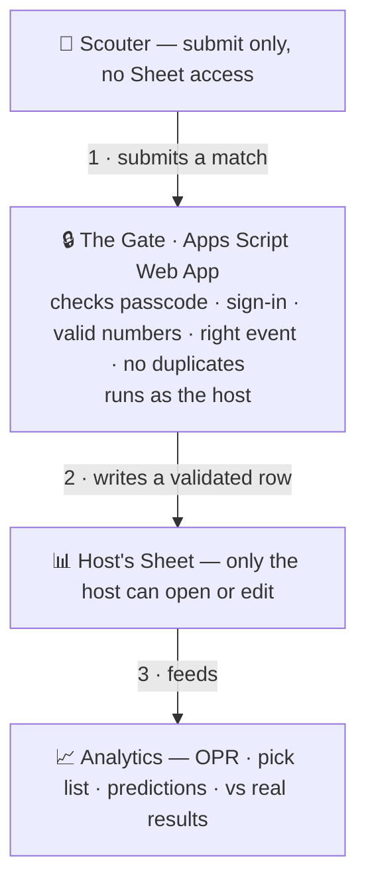

# Bobcat Scout — How to Use It

A plain-English, click-by-click guide for **two kinds of people**:

| Role | Who | What they do |
|---|---|---|
| **Host** | One person per team (e.g. you) — owns the Google Sheet | Sets everything up once, then shares one link |
| **Scouter** | Your teammates in the stands | Open the link, fill in matches |

> **The big picture:** the Host sets up a private Google Sheet that acts as the team's "inbox."
> Every Scouter's phone sends matches straight into that one Sheet. The Host then opens **📈 ANALYZE**
> to turn all that data into pick lists, predictions, and comparisons against the real results.

The app lives at **https://codeteamshere.github.io/bobcat-scout** — anyone can open it; what makes it
*yours* is the Sheet you connect to it.

---

# How it works & who can access what

Scouters can **send** matches into your Sheet, but they **never get access to the Sheet itself** — they can't open it, read other rows, or edit anything. Here's the path every match takes:

**Why scouters can't reach the Sheet:** when you deployed the script you set **"Execute as: Me"** and **"Who has access: Anyone."** Together these make a one-way gate:

- *Execute as: Me* → the script writes to the Sheet using **your** permissions, on the scouter's behalf. The scouter's Google account is never given any role on the Sheet.
- *Who has access: Anyone* → anyone can **call the script** (send a match) — **not** open the spreadsheet.

So a scouter's phone can only POST a match to your gate. It can't open, read, edit, or delete the Sheet — there's no sharing involved. And the gate still checks passcode + Google sign-in + event + sane numbers before it writes anything.

## Who can do what

| Who | Open / read Sheet | Edit / delete rows | Submit a match | See analytics |
|---|:---:|:---:|:---:|:---:|
| **Host (you)** | ✅ | ✅ | ✅ | ✅ |
| **Scouter** | ❌ | ❌ | ✅ (gated) | ❌\* |

\*Scouters only see analytics if you choose to share the ANALYZE view or the Sheet — by default the numbers are yours.

## Why your data lands clean for analytics

Every row the gate writes is already analysis-ready, because it:

- **Validates** — blank required fields or impossible numbers (bad team #, 350 scored in a 30-second period) are rejected at the door.
- **De-duplicates** — re-sending the same match + team **updates** that one row instead of doubling it.
- **Stamps** — each row records the scout's email + timestamp, so bad data is traceable.
- **Auto-tunes the Analytics tab** — the first submission teaches the Sheet your scoring model; the **Analytics** tab and **📈 ANALYZE** engine read straight from the clean Data tab (and can compare against the official Blue Alliance results).

---

# PART 1 — HOST: open it up and start using it

**Do this once.** Takes ~15 minutes. You need a Google account and a computer.

## Step 1 — Make your data "inbox" (Google Sheet + script)

1. Go to **https://sheets.google.com** and click **＋ Blank spreadsheet**.
2. Rename it (top-left) to something like **Bobcat Scouting 2026**.
3. Top menu → **Extensions → Apps Script**. A code editor opens in a new tab.
4. Select everything in that editor (**Ctrl+A**) and delete it.
5. Open **`apps-script/Code.gs`** from this project (on GitHub), copy **all** of it, and paste it into the empty editor.
6. Click the **save icon 💾**.
7. In the function dropdown at the top, pick **`firstTimeSetup`**, then click **▶ Run**.
   - Google will ask for permission the first time: **Review permissions → pick your account → Advanced → Go to (project) → Allow.** (This is normal — it's your own script writing to your own Sheet.)
8. Back in the Sheet you'll now see four tabs at the bottom: **Config, Data, Pit, Analytics**.

## Step 2 — Set your passcode, then publish the script

1. Click the **Config** tab. In column B:
   - **Passcode** — make up a simple password (e.g. `bobcat26`). Your scouters' link will carry this.
   - **Active Event** — your event code (e.g. `2026ctgla`), or leave blank to allow any event.
   - **Start/End Date** — optional; only accept data during your event.
2. Go back to the **Apps Script** tab → **Deploy → New deployment**.
   - Gear ⚙ → **Web app**
   - **Execute as:** Me
   - **Who has access:** **Anyone** ← important, or phones can't reach it
   - **Deploy**, then **copy the Web app URL** (it ends in `/exec`).

> Full screenshots-level detail is in **`SETUP-SHEET.md`**. Changing events later? Just edit the **Config** tab — no need to redeploy.

## Step 3 — Connect the app to your Sheet

1. Open **https://codeteamshere.github.io/bobcat-scout** and tap **⚙ SHEET** (top bar).
2. Paste the **Web app URL** and the **Passcode** (the same one from the Config tab). Tap **SAVE**.
3. Tap **SEND TEST ROW** — you should see **✓ Success** and a `CONNECTION TEST` row appear in your Sheet's **Data** tab. (Delete that row afterward.)

## Step 4 (optional) — Turn on team names + analytics data (The Blue Alliance)

This makes the app auto-fill team numbers from the match schedule, and lets **📈 ANALYZE** show real team
names, official OPR/rankings, and grade your scouting against real results.

1. Get a **free Read API key**: go to **https://www.thebluealliance.com/account**, sign in, find **Read API Keys**, type a description (e.g. `Bobcat Scout`), click **Add New Key**. Copy the long key it makes.
2. In the app: **⚙ SHEET → "TBA API KEY"** field → paste your key. Set the **Event Key** on the form (e.g. `2026ctgla`).
3. Tap **LOAD MATCH SCHEDULE** (auto-fills team #) — and in **📈 ANALYZE → Data → 📊 ADD OFFICIAL TBA DATA** to pull names/OPR/results.

> See **PART 4** for the API-key sharing question. Short answer: sharing it with *your own team* is fine.

## Step 5 (optional) — Lock it to your team's Google accounts (max security)

Only do this if you want to require sign-in so randoms can't submit.

1. In the Sheet's **Config** tab: set **Require Google Login → yes**, leave **Google Client ID** as the pre-filled one, and set **Allowed Domain** (e.g. `team177.org`) or **Allowed Emails** (a comma-separated list).
2. In the app: **⚙ SHEET → Google sign-in → Save & Enable** (the Client ID is already filled in for you).

The shared Client ID is **already built into the app** — it's public, not a secret, and your allow-list is what actually controls who can submit. (Details in `SETUP-SHEET.md`.)

## Step 6 — Build this year's form

The game changes every season. You don't touch any code:

1. Tap **🛠 FORM**.
2. **Fastest:** tap **📄 game manual → UPLOAD GAME MANUAL (PDF)** (or **PASTE SCORING TEXT**). The app reads the scoring and drafts every field + point value. *(Needs internet + a one-time free Puter sign-in popup.)*
3. **Always review** the yellow banner's reminder — check each **pts** value matches the manual, then **APPLY & SAVE**.
4. Or build it by hand: add sections/fields and type the points into the **pts** boxes.
5. Tap **EXPORT JSON** to send your scouters the exact same form (they tap **🛠 FORM → UPLOAD JSON**). The point values you set here power the whole ANALYZE engine.

## Step 7 — Share with your team

1. **⚙ SHEET → COPY SCOUT LINK.**
2. Send that one link to your scouters (group chat, text, QR poster).
3. **That link auto-configures everything** for them — your Sheet, passcode, TBA key, and Google sign-in (if on). They don't set up anything.

✅ **You're done. You can now scout, and so can your whole team.**

---

# PART 2 — SCOUTER: how your teammates use it

**Takes about a minute.** This is what you tell the rest of the team.

1. **Open the link the host sent you.** That's it — the app connects to the team's Sheet automatically. (No link? Tap **⚙ SHEET**, paste the URL + passcode the host gives you, **SAVE**.)
2. **If asked, tap "Sign in with Google"** once (only if your host turned on login).
3. **Scout a match:**
   - Tap the **mic** and describe it out loud (or type) — e.g. *"Team 177 red 2, scored 4 in auto, climbed high, smooth driver."*
   - Tap **AUTO-FILL FIELDS** → review what it filled → fix anything wrong.
   - Tap **GENERATE**, then **SUBMIT TO SHEET** — or just **SAVE & NEXT MATCH**, which submits *and* sets up the next match.
4. **Keep going.** One scouter scouts as many matches as they want — there's no limit, and the match number bumps up automatically.
5. **No signal?** The app saves your matches on the phone and shows a **SHEET (n)** counter; it sends them automatically once you're back online. The **QR code** is always there as a backup too.

💡 **Tip:** on a phone, use the browser menu → **Add to Home Screen** to install it like a real app. It then works fully offline.

---

# PART 3 — Make sense of the data (📈 ANALYZE)

This is mostly the Host / a strategist on a laptop, but anyone can open it.

1. Tap **📈 ANALYZE**.
2. **Data tab:** tap **USE THIS SESSION** (matches on this device), **IMPORT** (a CSV you downloaded from the Sheet's Data tab), or **LOAD SAMPLE SEASON** to explore. Tap **📊 ADD OFFICIAL TBA DATA** to layer in Blue Alliance names/OPR/results.
3. **Capabilities:** each team's points, consistency, reliability, and **OPR** (true scoring strength) — with the **official TBA OPR + rank** next to yours when loaded.
4. **Predict:** pick two alliances → win probability.
5. **Pick List:** choose your team → a ranked list of the best partners, with reasons + a plain-English game plan.
6. **Validation:** how often the engine called matches right — including **vs the real Blue Alliance results** once you've scouted an event. That's the number to trust.

---

# PART 4 — "Can I just send the API key to my team?"  ✅ Yes.

There are really **two different things** people call "keys" here, and **neither is a problem to share within your own team:**

### 1. Your Google Sheet link + passcode
This *is* meant to be shared — with **your** scouters, so their matches land in **your** Sheet. The **Copy Scout Link** button does this for you. Don't post it publicly (anyone with the link + passcode could submit), but sending it to your team is the whole point.

### 2. The Blue Alliance (TBA) API key
This is a **read-only key to public data** — the same scores, OPRs, and rankings anyone can already see on thebluealliance.com. It is **not** a password to anything private. So:

- ✅ **Sending it to your school team is totally fine** — that's exactly your situation (one team, using it together).
- ✅ The app **already shares it for you** — the **Copy Scout Link** bundles your TBA key into the link, so your scouters get it automatically.
- 🔄 **Low stakes:** even if it leaked, it only reads public data, and you can **delete/regenerate it in 5 seconds** on your TBA account page.

**Why "host to host" was ever mentioned:** the TBA key is tied to *a TBA account*, so a **different school/team** (a different Host with their own Sheet) needs *their own* free key. But **within one team** there's one Host (you) sharing with your scouters — which is allowed and intended. So: **yes, send it to your team and don't worry about it.**

> The Google **OAuth Client ID** (for the optional login) is already shared and built into the app for everyone — it's public and you never manage it.

---

# PART 5 — A different school/team wants to use it

The site is open to anyone, but each team is **independent** — they don't touch your Sheet or your data.

A new Host just repeats **PART 1** with their own stuff:
1. Their **own** Google Sheet + the script (Step 1–2).
2. Their **own** free TBA key (Step 4) — 2 minutes to make.
3. They build their form and share **their** scout link with **their** scouters.

Everyone reuses the same app and the same built-in Google Client ID; only the **Sheet + passcode + TBA key** are per-team. Your data and theirs never mix.

---

# Quick button reference

| Button | What it does |
|---|---|
| **⚙ SHEET** | Connect to your Google Sheet; paste TBA key; turn on Google login; **COPY SCOUT LINK** |
| **🛠 FORM** | Build/import this year's game form (PDF manual, paste, or by hand) |
| **📈 ANALYZE** | OPR, predictions, pick list, validation, + official TBA data |
| **mic / AUTO-FILL** | Turn a spoken/typed description into form fields |
| **GENERATE** | Make the QR + review the row |
| **SUBMIT TO SHEET / SAVE & NEXT** | Send the match to your Sheet (offline-safe) |

# FAQ

- **Do scouters need a Google account?** Only if the Host turned on Google login. Otherwise just the link + passcode.
- **Does it work without internet?** Yes — open it once online, then it works offline; matches queue and send when you're back online. The QR code is always available.
- **Do scouters need a TBA key?** No. Only whoever pulls analytics data needs it, and the scout link shares it for them.
- **Can one scouter do many matches?** Yes — unlimited; each match is its own row.
- **Changing the game next year?** Use **🛠 FORM** to rebuild it — no code, and the analytics retune automatically.
